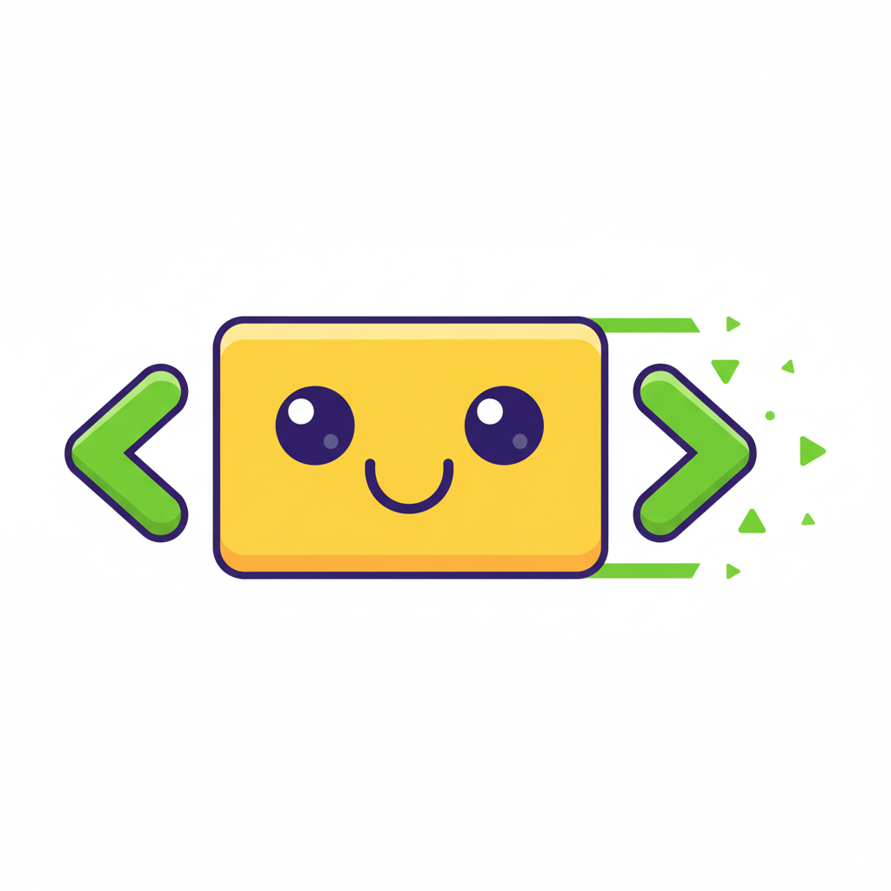

[](https://www.npmjs.com/package/invokers)
[](https://opensource.org/licenses/MIT)
[](https://github.com/doeixd/invokers)



# ✨ Invokers 

**Invokers is a tiny, modern JavaScript library that brings your HTML to life.** It empowers you to create rich, server-interactive user interfaces using the declarative power of standard HTML and ARIA attributes, with little to no custom JavaScript.

It listens for the native `command` attribute on `<button>` elements and uses semantic attributes like `aria-controls` to understand your intent. The result is clean, accessible, and maintainable HTML that just works.

-   **Platform-First:** Leverages native HTML (`<button>`) and ARIA attributes (`aria-controls`, `aria-expanded`).
-   **Declarative:** Describe *what* you want to happen in your HTML, not *how* to do it in JavaScript.
-   **Accessible by Design:** Guides you toward writing accessible markup that works for everyone.
-   **Server-Interactive:** Fetch content from the server without a page reload.
-   **Zero Dependencies:** Tiny, dependency-free, and framework-agnostic.
-   **Extensible:** A simple API to register your own custom commands.
-   **View Transitions:** Built-in support for the [View Transition API](https://developer.mozilla.org/en-US/docs/Web/API/View_Transitions_API) for beautiful, animated UI changes.

<br />

## 🧐 The Problem: The JavaScript-to-HTML Gap

Modern web development often follows a disconnected pattern:

1.  You write semantic HTML to structure your content.
2.  You write separate JavaScript to find those elements (using IDs or selectors) and "wire them up" with event listeners to make them interactive.

This leads to several pain points:
*   **Poor Code Locality:** The logic for an element's behavior lives far away from the element itself, making the code harder to read and maintain.
*   **Syncing Issues:** Manually keeping accessibility attributes like `aria-expanded` in sync with the UI state is tedious and error-prone.
*   **Boilerplate:** Simple interactions like toggling a menu or showing a tab panel require repetitive JavaScript boilerplate.
*   **Framework Overhead:** For many projects, pulling in a large framework just for simple UI interactivity feels like overkill.

## ✅ The Solution: Let Your HTML Do the Talking

Invokers closes the gap by making your HTML the single source of truth for behavior. It provides a simple, powerful bridge between user actions and UI changes, right in your markup.

**Before Invokers**, you might write this:

```html
<!-- You have to remember to add an event listener in your JS -->
<button id="menu-toggle">Menu</button>
<nav id="main-menu" class="hidden">...</nav>

<script>
  document.getElementById('menu-toggle').addEventListener('click', () => {
    const menu = document.getElementById('main-menu');
    menu.classList.toggle('hidden');
    // Don't forget to update ARIA!
    const isExpanded = !menu.classList.contains('hidden');
    event.target.setAttribute('aria-expanded', isExpanded);
  });
</script>
```

**With Invokers**, your HTML describes the entire interaction. No custom JavaScript needed.

```html
<!-- This just works. The HTML is self-explanatory. -->
<button command="toggle" aria-controls="main-menu" aria-expanded="false">
  Menu
</button>
<nav id="main-menu" hidden>
  <ul>...</ul>
</nav>

<!-- Add Invokers to your page -->
<script type="module" src="https://esm.sh/invokers"></script>
```

Notice the difference:
1.  **`command="toggle"`:** You declare the button's action directly on the element.
2.  **`aria-controls="main-menu"`:** You link the button to the element it controls using a standard accessibility attribute.
3.  **`aria-expanded="false"`:** Invokers automatically keeps this accessibility attribute in sync for you!


<br />

## ⚙️ How It Works

Invokers is simple by design. There's no complex virtual DOM or state management.

1.  When the library loads, it attaches a single, efficient event listener to the `document`.
2.  It listens for the native `command` event, which browsers automatically dispatch when a user activates a `<button>` element that has a `command` attribute.
3.  When a command is invoked, the library parses the command string (e.g., `class:toggle:is-active`).
4.  It looks up the registered function for that command (e.g., `class`).
5.  It executes the function, passing it a rich `context` object containing the button that was clicked (the "invoker"), its target elements (found via `aria-controls`), and any additional parameters.

This approach is performant, leverages browser standards, and keeps the library's footprint incredibly small.

<br />

## 🚀 Getting Started

You can add Invokers to your project in seconds.

### 1. Quick Start via CDN (Easiest)

For prototypes, static sites, or simple projects, add this script tag to the end of your `<body>`. The library will initialize itself automatically.

```html
<script type="module" src="https://esm.sh/invokers"></script>
```

### 2. Using npm/pnpm/yarn

For projects with a build step, install the package from the npm registry:

```bash
npm install invokers
```

Then, import it into your main JavaScript file. It will automatically set itself up.

```javascript
import 'invokers';
// That's it! Invokers is now listening for commands.
```

<br />

## 📚 API and Usage Examples

The primary way you'll use Invokers is through HTML attributes.

### Core Commands (`invokers`)

These commands are available out-of-the-box with the default import.

#### **`toggle`**
Toggles the `hidden` attribute on the target element(s). Perfect for accordions, disclosures, and menus.

```html
<h3>
  <button command="toggle" aria-expanded="false" aria-controls="faq-1">
    How do I install it?
  </button>
</h3>
<div id="faq-1" hidden>
  <p>Just add the script tag to your page! It's that easy.</p>
</div>
```

#### **`show`**
Shows the target element(s) and hides its sibling elements. It also manages the `aria-expanded` state for all related invokers, making it ideal for tab interfaces.

```html
<div role="tablist">
  <button command="show" aria-controls="panel-1" aria-expanded="true">Tab 1</button>
  <button command="show" aria-controls="panel-2" aria-expanded="false">Tab 2</button>
</div>
<div>
  <div id="panel-1" role="tabpanel">Content for Panel 1.</div>
  <div id="panel-2" role="tabpanel" hidden>Content for Panel 2.</div>
</div>
```

#### **`hide`**
Explicitly hides the target element(s) by adding the `hidden` attribute. Useful for "Close" or "Dismiss" buttons.

```html
<div id="alert-modal">
  <span>Important message!</span>
  <button command="hide" aria-controls="alert-modal" aria-label="Close">×</button>
</div>
```

#### **`class:<action>:<className>`**
A powerful namespaced command to manipulate CSS classes. The `<action>` can be `add`, `remove`, or `toggle`.

```html
<!-- Toggle a class on the #alert-box element -->
<button command="class:toggle:is-visible" data-target="#alert-box">
  Toggle Alert
</button>

<!-- Add a class to the body -->
<button command="class:add:dark-mode" data-target="body">
  Enable Dark Mode
</button>

<!-- The parser handles escaped colons for utilities like Tailwind CSS -->
<button command="class:toggle:md\\:grid" data-target="#container">
  Toggle Grid
</button>
```
> **Note:** Target elements for commands are found using the `aria-controls` attribute, which accepts one or more IDs. As a fallback, you can use `data-target` which accepts any CSS selector. `aria-controls` is preferred for its accessibility benefits.

### The Commands Module (`invokers/commands`)

For more advanced functionality, Invokers provides an optional module packed with powerful commands for server interaction, DOM manipulation, and more.

**To use them, you must import and register them:**

```html
<!-- From a CDN -->
<script type="module">
  import 'invokers';
  import { registerAll } from 'https://esm.sh/invokers/commands';

  // Make all extra commands available
  registerAll();
</script>
```

```javascript
// With npm
import 'invokers';
import { registerAll } from 'invokers/commands';

registerAll();
```

#### **`fetch:get`**
Performs a GET request to a URL and swaps the HTML response into the target element. It automatically handles loading and error states.

```html
<button
  command="fetch:get"
  data-url="/api/dashboard-widgets"
  aria-controls="content-area"
  data-loading-template="spinner-template"
  data-error-template="error-template"
>
  Load Dashboard
</button>

<div id="content-area" style="min-height: 50px;"></div>

<!-- Templates provide user feedback during the fetch lifecycle -->
<template id="spinner-template"><div>Loading...</div></template>
<template id="error-template"><p>Sorry, an error occurred.</p></template>
```

**Common `fetch` Attributes:**
*   `data-url`: The URL to fetch.
*   `data-loading-template`: ID of a `<template>` to show while loading.
*   `data-error-template`: ID of a `<template>` to show if the fetch fails.
*   `data-then-command`: A follow-up command to run after a successful fetch (e.g., `show`).
*   `data-header-*`: Adds a request header (e.g., `data-header-accept="application/json"` becomes `Accept: application/json`).

#### **`dom:remove`**
Removes the target element from the DOM. Great for dismissible alerts.

```html
<div id="toast-notification">
  Item saved!
  <button command="dom:remove" aria-controls="toast-notification">Dismiss</button>
</div>
```

A full suite of commands for media (`media:play`), forms (`form:reset`), clipboard (`clipboard:copy`), and more is available. Please consult the `src/invoker-commands.ts` file for a complete list and examples.


### ✨ Advanced Patterns

#### Chaining Commands
The commands module lets you chain actions. Use `data-then-command` to specify a command that should run after a successful asynchronous operation, like a `fetch`.

```html
<!-- This button will first fetch content, and on success, it will
     run the 'class:add:is-loaded' command on the target element. -->
<button
  command="fetch:get"
  data-url="/api/partial"
  aria-controls="content"
  data-then-command="class:add:is-loaded"
>
  Load and Animate
</button>

<div id="content" class="fade-in-container"></div>
```

#### Automatic View Transitions
If the [View Transition API](https://developer.mozilla.org/en-US/docs/Web/API/View_Transitions_API) is supported by the browser, Invokers will automatically wrap UI-changing commands (`toggle`, `show`, `fetch:*`, `dom:*`, etc.) in `document.startViewTransition`.

This means you can add smooth, animated transitions between UI states with just a few lines of CSS, without any extra JavaScript.

```css
/* Animate an element appearing or disappearing */
@keyframes fade-in { from { opacity: 0; } }
@keyframes fade-out { to { opacity: 0; } }

::view-transition-old(root) { animation: 300ms fade-out ease; }
::view-transition-new(root) { animation: 300ms fade-in ease; }
```

---

### 🔧 Extending Invokers: Your Own Commands

The true power of Invokers is its extensibility. You can easily register your own custom commands to encapsulate project-specific logic.

Use the global `window.Invoker.register` function to define a new command. The callback receives a `context` object with helpful utilities.

```javascript
if (window.Invoker) {
  /** @param {import('invokers').CommandContext} context */
  const customLogger = ({ invoker, params }) => {
    // `params` is an array of command parts after the registered name
    const level = params[0] || 'info'; // e.g., 'warn'
    const message = params.slice(1).join(' ') || 'Invoker was triggered!';

    console[level](message, { triggeredBy: invoker });
  };

  // Registering 'log' will handle `log:warn:Item deleted`, etc.
  window.Invoker.register('log', customLogger);
}
```

Now you can use your custom command directly in your HTML:

```html
<button command="log:warn:User is about to delete something important!">
  Log Warning
</button>
```

<br />

## 🛠️ Troubleshooting & FAQ

**My command isn't working!**
*   **Is the script loaded?** Make sure your `<script type="module" src="..."></script>` tag is present and correct. Check the browser console for any loading errors.
*   **Is it a `<button>`?** The native `command` event only fires for `<button>` elements.
*   **Is the `aria-controls` ID correct?** Ensure the ID you specified exists on an element in the page and there are no typos.
*   **Using a command from the module?** If you're using a command like `fetch:get` or `dom:remove`, did you remember to import and run `registerAll()` from `invokers/commands`?

**Why `aria-controls` over `data-target`?**
We prioritize `aria-controls` because it's a standard accessibility attribute that creates a semantic link between a controlling element (like a button) and the content it controls. This helps assistive technologies understand your UI. `data-target` is provided as a flexible fallback for cases where `aria-controls` might not be semantically appropriate or when you need to use more complex CSS selectors.

**How do I target multiple elements?**
The `aria-controls` attribute accepts a space-separated list of IDs. The command will be applied to all of them.
`<button command="toggle" aria-controls="menu-1 menu-2">Toggle Both</button>`

## 🤝 Contributing

Contributions are welcome! Whether it's reporting a bug, proposing a new command, or improving the documentation, your help is appreciated. Please feel free to open an issue or submit a pull request on our [GitHub repository](https://github.com/doeixd/invokers).

## 📄 License

Invokers is open-source software licensed under the [MIT License](https://opensource.org/licenses/MIT).